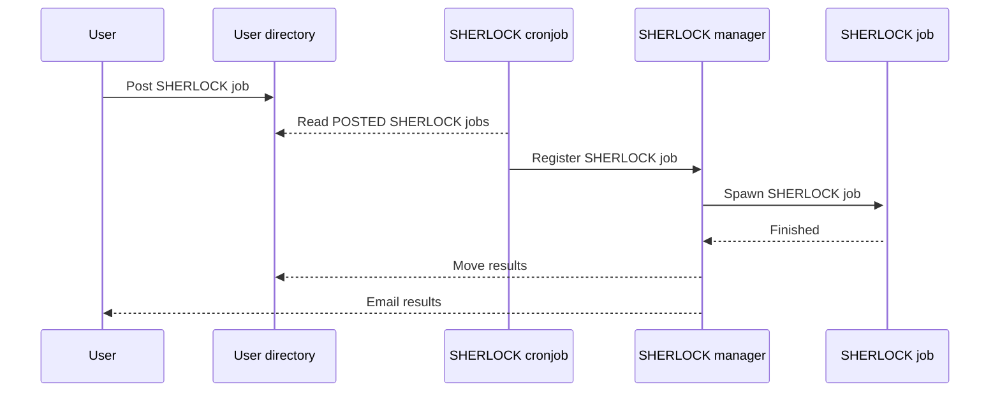

```mermaid
sequenceDiagram
    User->>User directory: Post SHERLOCK job
    SHERLOCK cronjob-->>User directory: Read POSTED SHERLOCK jobs
    activate SHERLOCK job
    SHERLOCK cronjob->>SHERLOCK manager: Register SHERLOCK job
    SHERLOCK manager->>SHERLOCK job: Spawn SHERLOCK job
    SHERLOCK job-->> SHERLOCK manager: Finished
    SHERLOCK manager-->>User directory: Move results
    SHERLOCK manager-->>User: Email results
```
