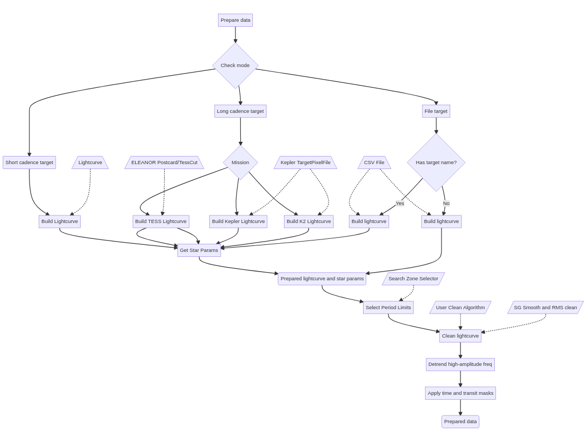
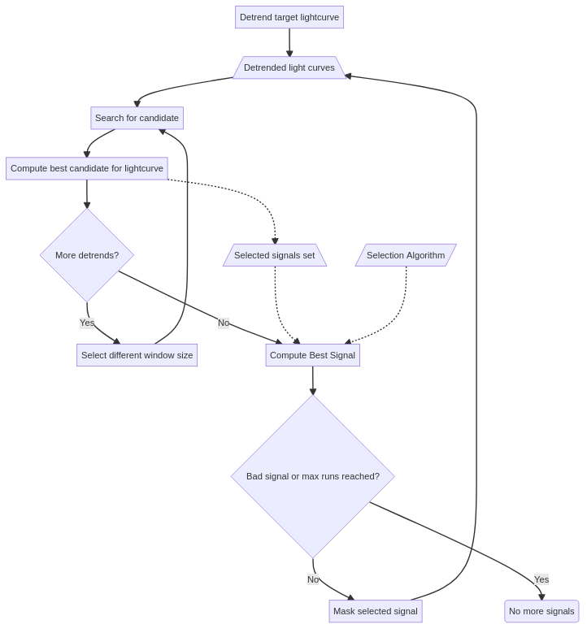

.. SHERLOCK PIPEline documentation master file, created by
   sphinx-quickstart on Thu Jul  8 08:43:51 2021.
   You can adapt this file completely to your liking, but it should at least
   contain the root `toctree` directive.

=====================
Search for candidates
=====================

The candidates search is the entrypoint of the **SHERLOCK PIPEline**. The first action that the astronomer might want
to check on a lightcurve is a search of transiting candidates signals. From a friendly usage perspective, the easiest
way to perform a search process is by running:

``python3 -m sherlockpipe --properties yourPropertiesFile.yaml``

You only need to provide a YAML file with any of the properties contained in the internal
`properties.yaml <https://github.com/franpoz/SHERLOCK/blob/master/sherlockpipe/properties.yaml>`_
provided by the pipeline. You'd need to fill at least one object under the ``TARGETS`` section for the
pipeline to do something. If you still have any doubts please refer to the
`examples/properties <https://github.com/franpoz/SHERLOCK/tree/master/examples/properties>`_ directory

Additionally, you could only want to inspect the preparation stage of **SHERLOCK** and therefore, you can execute it without
running the analyse phase so you can watch the light curve, the periodogram and the initial report to take better
decisions to tune the execution parameters. Just launch **SHERLOCK** with:

``python3 -m sherlockpipe --properties my_properties.yaml --explore``

and it will end as soon as it has processed the preparation stages for each object.

------------------
Preparation stage
------------------

SHERLOCK needs to identify the type of source[s] that the user has selected in order to choose the proper data cooking
flow to finally provide standard information for the target star and the photometric measurements in time series format.
The easiest way to depict the process is by following the next diagram:

..
   .. mermaid::

      flowchart TB
          A[Prepare data] --> B{Check mode}
              B --> C[Long cadence target]
              B --> D[Short cadence target]
              B --> E[File target]
              C --> F{Mission}

              D --> Short_builder[Build Lightcurve]
              Lightkurve[/Lightcurve\] -.-> Short_builder
              Short_builder --> StarInfo[Get Star Params]

              F --> TESS_Long[Build TESS Lightcurve]
              F --> Kepler_Long[Build Kepler Lightcurve]
              F --> K2_Long[Build K2 Lightcurve]
              ELEANOR[/ELEANOR Postcard/TessCut\] -.-> TESS_Long
              LightKurve[/Kepler TargetPixelFile\] -.-> Kepler_Long
              LightKurve[/Kepler TargetPixelFile\] -.-> K2_Long
              TESS_Long --> StarInfo[Get Star Params]
              TESS_Long --> StarInfo
              Kepler_Long --> StarInfo
              K2_Long --> StarInfo

              StarInfo --> Target_lightcurve(Prepared lightcurve and star params)

              E --> HasName{Has target name?}
              File[/CSV File\] -.-> BuildFromFile
              File[/CSV File\] -.-> BuildFromFile1
              HasName -- No --> BuildFromFile[Build lightcurve]
              HasName -- Yes --> BuildFromFile1[Build lightcurve]
              BuildFromFile --> Target_lightcurve
              BuildFromFile1 --> StarInfo

              Target_lightcurve --> SelectPeriods[Select Period Limits]
              SearchZone[/Search Zone Selector/] -.-> SelectPeriods
              SelectPeriods --> CleanCurve[Clean light curve]
              CustomPreparer[/User Clean Algorithm/] -.-> CleanCurve[Clean lightcurve]
              SGRMS[/SG Smooth and RMS clean/] -.-> CleanCurve
              CleanCurve --> HighPeriod[Detrend high-amplitude freq]
              HighPeriod --> ApplyMask[Apply time and transit masks]
              ApplyMask --> PreparedData(Prepared data)

In the preparation stage the user also would be able to select some pre-settings that would modify the search
pre-conditions. One of them is the *Search Zone Selector* which will allow you to tell *SHERLOCK* to only search for candidates around the optimistic habitable zone or the
restricted habitable zone of the star. In addition, you could give your own `SearchZone <https://github.com/franpoz/SHERLOCK/tree/master/sherlockpipe/sherlockpipe/search_zones/SearchZone.py>`_ implementation based
on the star properties.

For a complete custom *SHERLOCK* pre-processing we added the *User clean Algorithm* that you can provide with an implementation
of the base `CurvePreparer <https://github.com/PlanetHunters/lcbuilder/tree/master/lcbuilder/lcbuilder/curve_preparer/CurvePreparer.py>`_.

---------------
Search stage
---------------
Once the preparation stage is already performed, the search iterations begin. SHERLOCK uses `wotan <https://github.com/hippke/wotan>`_ to generate ``N``
different lightcurves whose main difference is the window size of the detrending algorithm used to generate them. That
is, we increase the window size from the lowest possible value that would not affect a long transit until an upper value
that can be customized by the user. To illustrate the search algorithm we provide the next figure:

..
   .. mermaid::

      flowchart TB
          A[Detrend target lightcurve] -.-> B[/Detrended light curves\]
          A --> C[Search for candidate]
          ModelTemplate[/Transit Template/] -.-> C
          B -.-> C
          C --> D[Compute best candidate for lightcurve]
          D --> F{More detrends?}
          F -- Yes --> G[Select different window size]
          G --> C
          F -- No --> Compute[Compute Best Signal]
          D -.-> Signals[/Selected signals set\]
          Signals[/Selected signals set\] -.-> Compute
          SelectionAlgorithm[/Selection Algorithm/] -.-> Compute
          Compute --> Good{Bad signal or max runs reached?}
          Good -- No --> Mask[Mask selected signal]
          Mask --> C
          Good -- Yes --> End(No more signals)

We will proceed to explain some of the boxes from the diagram. The *Transit Template* one represents the selected option
of the kind of transit shape to be searched for into the folded light curve:

* **tls**: A batman-modeled transit shape.
* **bls**: The classical Box-Least Squares model.
* **grazing**: A grazing transit model
* **tailed**: An approach to a tailed-object transit model like comets or disintegrating planets (this is currently included as an experimental feature).
* **custom**: You can even implement your own transit model by extending our custom ``foldedleastsquares`` (fork from ``transitleastsquares``) `TransitTemplateGenerator <https://github.com/martindevora/tls/blob/master/transitleastsquares/template_generator/transit_template_generator.py>`_ class.

The injected *Selection Algorithms* is the selection of the user of the way to decide which signal is the best one for each run:

* **Basic**: SHERLOCK will select the signal with highest SNR from all the detrended lightcurves for the current run.
* **Border correct**: SHERLOCK will perform a correction on the SNR values of the selected signals from each detrended lightcurve depending on how many of their transits take place besides empty-data measurement gaps. This was developed because the quantity of false positives is highly increased when there are events close to those gaps affecting the folded lightcurve detected signal.
* **Quorum algorithm**: Built on top of the ``Border correct`` algorithm, this one will correct the SNR of the selected signal for each detrended lightcurve also by counting the number of detrends that selected the same signal.
* **Custom algorithm**: The user can also inject his own signal selection algorithm by implementing the `SignalSelector <https://github.com/franpoz/SHERLOCK/tree/master/sherlockpipe/scoring/SignalSelector.py>`_ class. See the `example <https://github.com/franpoz/SHERLOCK/tree/master/examples/properties/custom_algorithms.yaml>`_.

---------------
Reporting
---------------

SHERLOCK produces several information items under a new directory for every analysed object:

* **Object report log**: The entire log of the object run is written here.
* **Most Promising Candidates log**: A summary of the parameters of the best transits found for each run is written at the end of the object execution. Example content:

   .. code-block::

      Listing most promising candidates for ID MIS_TIC 470381900_all:
      Detrend no. Period  Duration  T0      SNR     SDE     FAP       Border_score  Matching OI   Semi-major axis   Habitability Zone
      1           2.5013  50.34     1816.69 13.30   14.95   0.000080  1.00          TOI 1696.01   0.02365           I
      4           0.5245  29.65     1816.56 8.34    6.26    0.036255  1.00          nan           0.00835           I
      5           0.6193  29.19     1816.43 8.76    6.57    0.019688  1.00          nan           0.00933           I
      1           0.8111  29.04     1816.10 9.08    5.88    0.068667  0.88          nan           0.01116           I
      2           1.0093  32.41     1817.05 8.80    5.59    nan       0.90          nan           0.01291           I
      6           3.4035  45.05     1819.35 6.68    5.97    0.059784  1.00          nan           0.02904           I

* **Runs directories**: Containing png images of the detrended fluxes and their suggested transits. Example of one detrended flux transit selection image:

   .. image:: _static/example_run.png
      :alt: Example Run

* **Light curve csv file**: The original (before pre-processing) PDCSAP signal stored in three columns:

   .. code-block::

      #time,flux,flux_err
      1816.0895073542242,0.9916135,0.024114653
      1816.0908962630185,1.0232307,0.024185425
      1816.0922851713472,1.0293404,0.024151148
      1816.0936740796774,1.000998,0.024186047
      1816.0950629880074,1.0168158,0.02415397
      1816.0964518968017,1.0344968,0.024141008
      1816.0978408051305,1.0061758,0.024101004
      ...

* **Candidates csv file**: Containing the same information than the Most Promising Candidates log but in a csv format so it can be read by future additions to the pipeline like vetting or fitting endpoints.
* **Star parameters csv file**: Containing several parameters of the host star.
* **Lomb-Scargle periodogram plot**: Showing the period strengths. Example:

   .. image:: _static/periodogram.png
      :alt: Periodogram

* **RMS masking plot**: In case the High RMS masking pre-processing is enabled. Example:

   .. image:: _static/rms.png
      :alt: RMS

* **Phase-folded period plot**: In case auto-detrend or manual period detrend is enabled.

   .. image:: _static/autodetrend.png
      :alt: RMS

---------------
Tutorials
---------------

.. toctree::
   :maxdepth: 2
   :caption: Contents:

   toi-178-programmatical

