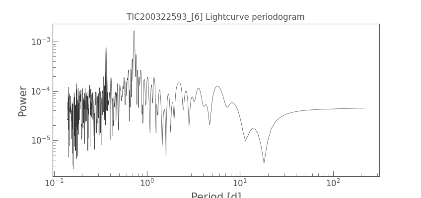
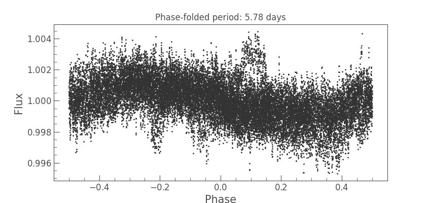
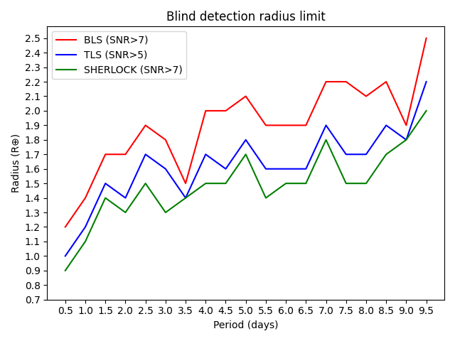

# Summary

Transit detection of exoplanets is one of the most fruitful methods for finding planets beyond the Solar System. 
At the time of writing, more than 4,000 exoplanets have been discovered, most of them by the transit method; that is, when a planet passes in front of the disk of its host star it blocks a fraction of the star light, creating a decrease in the observed flux. After the transit, the total
flux rises again to its nominal value.

The transit method was revolutionised by the *Kepler* (and its extended *K2*) mission, which launched in 2009 and operated until 2018. *Kepler* discovered 
more than 2,600 confirmed planets, and its legacy data keep offering exciting results [@niraula:2020; @socia:2020]. Since 2018, another space-based satellite replaced *Kepler* in the hunt for transiting exoplanets: the *TESS* (Transiting Exoplanets Satellite Survey) mission [@ricker:2015]. Different to *Kepler*, which performed its planet search in a reduced portion of the sky, *TESS* is a nearly all-sky survey that focuses on the nearest and brightest stars, searching for planets well suited for, among other science goals, future atmospheric characterization. After completion of its nominal, two-year mission in July 2020, *TESS* started its extended mission, which will last until 2022. During its first two years of operation, *TESS* has released more than 2,000 TOIs (TESS Objects of Interest) and confirmed more than 50 planets. 

Taken together, *Kepler*, *K2* and *TESS*, yield a huge data base of continuous, high-quality observations with excellent photometric precision. 

Motivated to make the most of this considerable abundance of data, in this work we present an open-source pipeline which aims to aid exploration of the data obtained with the aforementioned missions, in the search for new exoplanets. In particular, we are interested in threshold-crossing events, which due to their shallowness remained unnoticed by the current automatic pipelines. 


# 1. The SHERLOCK PIPEline 

The ``SHERLOCK`` (Searching for Hints of Exoplanets fRom Light curves Of spaCe-based seeKers) ``PIPEline``, in short ``SHERLOCK``, is a Python package ready-to-use and user-friendly, which aims to minimize user efforts to download, search, vet and fit planetary candidates. ``SHERLOCK`` is partially based on previous well-known and well-tested codes used by the exoplanet community to explore the public data gathered by the *Kepler*, *K2* and *TESS* missions without needing to know the finer minutiae of how these data were obtained and stored. In most cases the user only needs to provide a KIC-ID, EPIC-ID, TIC-ID or coordinates of the host star to search for exoplanets. ``SHERLOCK`` has been successfully tested for first time in @pozuelos:2020, @demory:2020 and @benni:2020. 

## 1.1 Searching for candidates

``SHERLOCK`` makes use of the ``LIGHTKURVE`` [@lightkurve:2018], ``WOTAN`` [@wotan:2019], ``ELEANOR`` [@eleanor:2019] and ``TRANSIT LEAST SQUARES`` [@tls:2019] packages to download, process and search for exoplanets in any of the thousands of public light curves provided by *Kepler* and *TESS* missions. Alternatively, the user may provide the light curves in a csv file with "time", "flux" and "flux_err". As output, ``SHERLOCK`` produces a collection of
plots and log files which allow the user to explore the most promising signals. ``SHERLOCK`` uses a multi-detrend approach; that is, it performs a number of detrends by varying the window or the kernel size, depending if the detrending process is bi-weight or Gaussian. Then, ``SHERLOCK`` performs a transit search over the full set of detrended light curves and the original one. This strategy is motivated by the associate risk of removing transit signals, in particular short and shallow ones, during the detrend phase.

The basic usage of ``SHERLOCK`` consists of completing a [properties.yaml](https://github.com/franpoz/SHERLOCK/blob/master/sherlockpipe/properties.yaml) 
file, where the user needs to specify some basic parameters. We encourage the reader to thoroughly consult this file, as well as the examples provided there, to get a firmly understanding of how to effectively use ``SHERLOCK``.

To run ``SHERLOCK``, one only needs to execute: 

```shell
python3 -m sherlockpipe --properties properties.yaml
```

## 1.2 Vetting promising signals

Once the search is done and the user has found a promising candidate, the next step would be to perform some diagnostic tests to check whether the identified signal has an instrumental 
origin and to rule out alternative astrophysical sources. For *TESS* candidates ``SHERLOCK`` uses ``LATTE`` [@eisner:2020], a user-friendly package which examines different aspects such as momentum dumps, background flux, *X-Y* centroid positions, photometric aperture effect, pixel-level centroid analysis, nearby companion stars, nearest-neighbour light curves, and pixel-level light curves. In addition, via ``tpfplotter`` [@aller:2020], a target pixel file is provided, which contains the aperture used to extract the ``PDCSAP`` fluxes (see Section 3.1) and the *Gaia* DR2 catalogue. This allows the user to identify which stars might be affecting the light curve of a given candidate. To test the alternative astrophysical sources, ``SHERLOCK`` uses ``TRICERATOPS`` [@giacalone:2021] to estimate the probabilities for different astrophysical scenarios such as transiting planet, eclipsing binary, eclipsing binary with 2$\times$ orbital period, among others. Collectively, these analyses help the user estimate the reliability of a given detection. In future releases we will extend our vetting tool to *Kepler* and *K2* data. 

Running this vetting tool for a particular signal is as simple as: 
 
```shell 
python3 -m sherlockpipe.vet --candidate {number_of_the_candidate} 

```

by replacing {number_of_the_candidate} with 1, 2, 3, etc., the tool will print a collection of plots. To fully understand these vetting packages, we refer the reader to @eisner:2020, @aller:2020 and @giacalone:2021 respectively.

## 1.3 Fitting promising candidates

After the vetting process, the next step would be to schedule ground-based observations to firmly confirm the event in the target star or to identify potential false positives due to variable stars,
such as an eclipsing binary (EB). To this aim, it is critical to have the most accurate ephemeris as possible. Unfortunately, the solution currently given by the serach via``TLS`` is not optimal to this end, and it is desirable to perform a proper fitting of the transits. There are a number of available public codes which might be used to this end, where ``Juliet`` [@espinoza:2019], ``Exofast`` [@eastman:2019], and ``allesfitter`` [@gunther:2020] are some examples. 
In ``SHERLOCK``, ``allesfitter`` is used. 

To fit a candidate, the user only needs to execute: 
    
```shell 
python3 -m sherlockpipe.fit --candidate {number_of_the_candidate} 

```

Whereby ``SHERLOCK`` saves, jointly with the PDCSAP fluxes, all the light curves generated during the detrending phase. This allows the user the opportunity to use them to fit any other result. 


# 2. The ``SHERLOCK PIPEline`` workflow  

## 2.1 Data downloading
The light curve within which the user wants to search for exoplanets is downloaded from the NASA Mikulski Archive for Space Telescope (``MAST``). In the case of *TESS* data, the 
Pre-search Data Conditioning Simple APerture (PDCSAP) fluxes given by the ``SPOC`` (Science Process-ing  Operations  Center) are used. For *Kepler* data, the Pre-search Data
Conditioning (PDC) given by the ``SOC`` (Science Operations Center) are used. In both cases, these light curves are corrected for systematic error sources, such as pointing drift,
focus changes and thermal transients. In the case of exploring the full-frame images (FFIs) from *TESS*, the default PCA (principal component analysis) 
fluxes provided by ``ELEANOR`` can be used, although the user can choose among the different available data products such as the raw, corrected, PCA, and PSF-modelled fluxes [@eleanor:2019]. 


## 2.2 Pre-processing of light curve
In many cases the user may find light curves which contain several systematics like noise, high dispersion
near borders, intense periodicities caused by pulsators, fast rotators, etc. ``SHERLOCK`` 
provides some methods to reduce the effects of these important systematics.

### 2.2.1 Local noise reduction
For local noise, where very close measurements show high deviation from the local trend, we apply a
Savitzky-Golay filter [@sg:1964]. In all our tests, this filter provided a significant improvement of the signal-to-noise ratio (SNR) of previously identified transits.
This implementation is specially interesting in the search for shallow transits. However, the number of false positives is also incremented, and the user needs to verify that 
the proposed signal is realistic, for example checking the transit shape, duration etc. 
This feature can be enabled/disabled by the "INITIAL SMOOTH ENABLED" flag in the [properties.yaml](https://github.com/franpoz/SHERLOCK/blob/master/sherlockpipe/properties.yaml) file.

### 2.2.2 High RMS self-masking
It happens sometimes that a particular region of a given light curve is very noisy, e.g. due to jitter induced by 
the spacecraft, high-light scattering, momentum dumps, etc., which cannot be corrected with a simple detrending process. 
These noisy regions all have high root-mean-square (RMS) noise in comparison with the running mean, and
might have a strongly negative impact on the performance of any pipeline which aims to search for planets, even resulting in all of the potential planets remaining undetected. 
To overcome this issue ``SHERLOCK`` automatically identifies and masks these noisy regions. To this aim, ``SHERLOCK`` includes a binned RMS computation, where bins whose
RMS values are higher than a configurable factor multiplied by the running mean get automatically masked. 
From our experience, appropriate thresholds range from 1.1 to 2.5 times the running mean (see \autoref{fig:rms}).
This feature can be enabled/disabled by the "INITIAL HIGH RMS MASK: True/False" flag. The threshold can be set in the "INITIAL HIGH RMS THRESHOLD" flag. 
Both of these properties are modified in the [properties.yaml](https://github.com/franpoz/SHERLOCK/blob/master/sherlockpipe/properties.yaml) file.

### 2.2.3 Input time-range masking
The user may identify a region with low-quality data where the automatic self-masking 
function is not acting properly. In this situation, the user can manually give the time which should be masked. 
If enabled, this feature automatically disables the automatic self-masking feature.
Some examples are provided in the [properties.yaml](https://github.com/franpoz/SHERLOCK/blob/master/sherlockpipe/properties.yaml) file, in the 
INITIAL MASK module.

### 2.2.4 Automatic detrending of intense periodicities
Our most common foe with high periodicities are fast-rotators, which impart a highly sinusoidal-like
trend in the PDCSAP fluxes. This is why ``SHERLOCK`` includes an automatic intense periodicity
detection and detrending during its preparation stage. This feature is controlled by several flags in the 
[properties.yaml](https://github.com/franpoz/SHERLOCK/blob/master/sherlockpipe/properties.yaml) file:
"AUTO DETREND ENABLED", "AUTO DETREND METHOD", "AUTO DETREND RATIO" and "AUTO DETREND PERIOD". The reader is encouraged to consult the examples given 
in the [properties.yaml](https://github.com/franpoz/SHERLOCK/blob/master/sherlockpipe/properties.yaml) file for further 
details and examples.

### 2.2.5 Input period detrending
If the user already knows, for example, that a given target is a fast rotator, and knows its period, this can be directly provided by the user to ``SHERLOCK``.
This input has to be included in the "INITIAL DETREND PERIOD" module in the [properties.yaml](https://github.com/franpoz/SHERLOCK/blob/master/sherlockpipe/properties.yaml) file.
If enabled, this feature automatically disables the automatic detrend of intense periodicities function. 

## 2.3 Detrending process

Once the pre-processing is done, ``SHERLOCK`` makes use of the ``WOTAN`` package to remove stellar noise, instrumental drifts or any other unwanted trends that may affect the detectability of transiting planets. Two different detrending methods are implemented: 
bi-weight and Gaussian process with a Mat\'ern-3/2 kernel. To optimize the search for transits, the pipeline is run for a number of trials in which the window and kernel sizes 
are varied for each respective aforementioned method. The method used to detrend and the number of trials are set in the "DETRENDS SETUP" module, under the flags "DETREND_METHOD"
and "DETRENDS_NUMBER", respectively. 
The goal of this multi-detrending approach is avoid the potential risk of removing shallow and short transiting signals. While the minimum and maximum window and kernel sizes might be specified
by the user in the [properties.yaml](https://github.com/franpoz/SHERLOCK/blob/master/sherlockpipe/properties.yaml) file, ``SHERLOCK`` offers the option of computing these values automatically: 
the minimum value is obtained by computing the transit duration ($T_{14}$) of a hypothetical Earth-size planet with a period of 15 days orbiting the target star (i.e., to obtain the minimum period, at least 
two transits in one *TESS* sector or one *Kepler* sub-quarter are required). To protect a transit of at least this duration from being removed, we chose a minimum window size of $3\times T_{14}$. 
After conducting experiments, the optimal maximum value explored has been fixed to $20\times T_{14}$, which seemed sufficient to remove low-frecuency variability of most stars. As mentioned previously, these values may be refined by the users, to optimaze their findings. An example of this proccess is displayed in \autoref{fig:detrends}.


## 2.4 The search

For each light curve, ``SHERLOCK`` searches for planet candidates making use the ``TRANSIT LEAST SQUARES`` package, which uses an analytical transit model based on
stellar parameters, and is optimized for the detection of shallow periodic transits [@tls:2019]. ``SHERLOCK`` iteratively executed what we call `runs`. Hence, in each run
the PDCSAP fluxes and the n-detrended light curves that the user indicated in the [properties.yaml](https://github.com/franpoz/SHERLOCK/blob/master/sherlockpipe/properties.yaml)
file are examined. For each light curve, the best periodic signal found jointly with the corresponding periodogram is plotted. That is, if the user used six detrended models, the results of each run will be printed as seven (six-detrended and the PDCSAP flux light curves) `runs plots`, which are saved in specific folders. Moreover, for each light curve, the main results obtained are printed in a log file containing the `period (days)`, `period_err (days)`, `number of transits detected`, `mean depths (ppt)`, `transit duration (min)`, `Epoch (TBJD)`, `Signal-to-noise ratio (SNR)`, `signal detection efficiency (SDE)`, `false alarm probability (FAP)`, `border score`, `Matchin OI`, `Harmonic`, `planet radius` ($R_{\oplus}$), `Rp/Rs`, `Habitability zone`. This information allows the user to evaluate and understand their results. We encourage the reader to thoroughly consult the [examples](https://github.com/franpoz/SHERLOCK/tree/master/examples) in the ``SHERLOCK``'s GitHub site for a better understanding. 

Data close to borders are usually less accurate, and often they have a larger dispersion than the rest of the data. Hence, if a planetary candidate has many of its transits close to borders, this may indicate a false positive. To visualize this effect we included a `border-score` parameter which ranges from 0 to 1, where 
1 means that none of the transits are near the borders, and 0 indicates the opposite. This parameter allows the user to easily identify false positives
in the generated reports.

This part of the code is parallelized, so, making use of ``SHERLOCK`` in a cluster with several cores will considerable speed-up the time of execution. 


## 2.5 Exploring the by-products and results 

``SHERLOCK PIPEline`` produces several information items under a new directory for every analysed object:

* Object report log file: the entire log of the object run is written here.
* Most promising candidates log file: a summary of the parameters of the best transits found for each
run is written at the end of the object execution. 
* Runs directories: for each run of ``SHERLOCK``, a folder will be generated which contains .png images of the detrended fluxes and their suggested transits (\autoref{fig:run}) 

![Example of one detrended light curve which would be stored in the folder `RUN 1`. The header provides the main parameters for the most promising signal. There are three panels, from top to bottom: (1) relative fluxes with the candidate signal overplotted in red; (2) a phase-folded light curve for the candidate. The binning is authomatically chosen to ensure that there will be about 10 points in-transit region. The model for the candidate is given by the solid-red line; and (3) the periodogram where the main period signal and its harmonics are highlighted.\label{fig:run}](example_run1.png)


* Light curve .csv files: original (before pre-processing, that is the PDCSAP fluxes) and all the detrended light curves are saved individualy in .csv files which contain three columns: `#time`, `flux` and `flux_err`.

* Lomb-Scargle periodogram: this plot corresponds to the Section "(3.2.4) Automatic detrend of intense periodicities", which shows the period strengths (see \autoref{fig:periodogram}).



* Phase-folded period: in the case where auto-detrending or manual period detrending is enabled (Sections 3.2.4 and 3.2.5, respectively), it is plotted the phase-folded light curve over the strongest period in the Lomb-Scargle periodogram or the period provided by the user, respectively.

{width=80%}


* RMS masking plot: In case where the high RMS masking pre-processing step is enabled (Section 3.2.2 and 3.2.3) (see \autoref{fig:rms}).


# 3. Performance

To test the performance of ``SHERLOCK`` in comparison to other methods used to finding threshold-crossing events, we carried out a suite of inject-and-recovery experiments using a test *TESS* light curve, corresponding to a single sector. The light curve was injected with a synthetic sample of planets with radii in the range of 0.7 to 2.5 $R_{\oplus}$ with steps of 0.5 $R_{\oplus}$, and periods in the range 0.5-9.5 days, with steps of 0.1 day. In addition, we evaluated each scenario at five different epochs. Hence, in total we evaluated a total of 1710 scenarios. Then, we ran three different methods to find and recover the signals: (1) a search using a classical box least squares algorithm [@kovacs:2002], with an SNR threshold limit of 7 to claim a planet as recovered; (2) a search using the transit least square algorithim, with an SNR threshold limit of 5 to claim a planet as recovered; and (3) a search using ``SHERLOCK`` with an SNR threshold limit of 7, and a maximum of five runs. We found that ``SHERLOCK`` is the most efficient algorithm, being able to recover sub-Earth planets in short-period orbits and about 2 $R_{\oplus}$ for periods as large as 10 days (see \autoref{fig:performance}).




# 4. Scientific cases 

The ``SHERLOCK PIPEline`` is specially devoted for: 

1) Easily explore public data obtained with space-based observatories. 
2) Find threshold-crossing events that were not reported by the automatic pipelines of *TESS* and *Kepler*.
3) Recover planets already reported, and search for extra candidates in a given system.
4) Search for planets in light curves processed by the user. 
 
That is, ``SHERLOCK`` might be used for a number of projects which need to explore light curves in the search for exoplanets. For example, it is used 
in the *SPECULOOS-TESS* alliance [@sebastian:2021], and in the hot-subdwarf survey in the search for planetary remnats [vangrootel:2021]
(see the [Hot-subdwarf catalogues](https://github.com/franpoz/Hot-Subdwarfs-Catalogues)).


# 5. Future implementations  

While the  goal of the ``SHERLOCK PIPEline`` is to search for and find planets, there is still a number of improvements which will make the user's life easier. In particular, we have identified some 
relevant features that we are continuously developing and implementing. Here are the most urgent features at the time of writing: 

## 5.1 Pulsating stars

While the automatic detrend of intense periodicities module (Section 3.2.4) allows the user to remove pulsation-like features, it is 
very common that stars pulse in different modes, which is more complex than simple variability. To handle this issue, we will implement a more robust characterization of stellar pulsations. In particular, high-frequency pressure-mode (p-mode) pulsators which have relatively high amplitudes and can hinder the detection of shallow transits [@sowicka:2017].

## 5.2 Disentigrating planets

We are including in ``SHERLOCK`` a model for comet-like tails of disintegrating exoplanets, which highly differ from the typical shape of transiting exoplanets; see, e.g. [@rappaport:2012,@sanchis:2015]. 


## 6. Summary and conclusions

We presented the ``SHERLOCK PIPEline``, a python package to easily search for exoplanets in light curves obtained by space-based missions such as *Kepler*, *K2* and *TESS*, or light curves directly provided by the user. ``SHERLOCK`` has proved to be robust and enfficient, specially suited for the detection of threshold-crossing events that may remain unnoticed by the automatic official pipelines. 
The user only needs to fill the [properties.yaml](https://github.com/franpoz/SHERLOCK/blob/master/sherlockpipe/properties.yaml) file and use three command lines to search, vet and fit candidates: 

```shell
python3 -m sherlockpipe --properties properties.yaml

python3 -m sherlockpipe.vet --candidate {number_of_the_candidate} 

python3 -m sherlockpipe.fit --candidate {number_of_the_candidate} 

```

After its execution, ``SHERLOCK`` provides a collection of folders, plots and log files containing all the information needed by the user to search and find new exoplanets. 

# Acknowledgements

We acknowledge balblabla


# References
