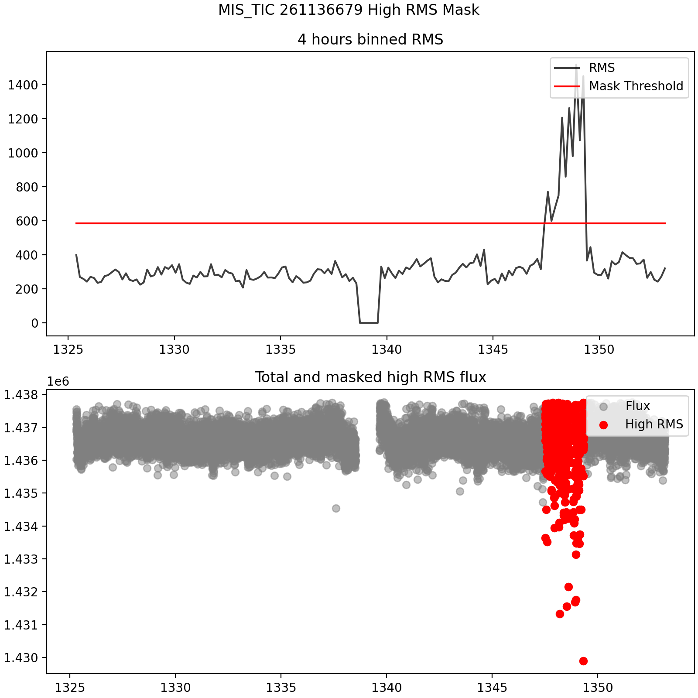

# Summary

Transit detection of exoplanets is the one of the most fruitful methods to find planets beyond the Solar System. 
At the time of writting, more that 4,000 exoplanets have been discovered, most of them
by the transit method, that is, a planet passes in front the disk of its host star, 
blocking a fraction of the star light, and provoking a decrease of the observed flux. After the transit, the total
flux rises again to its nominal value.

The transit method was revolutionised by the *Kepler* (and its extended *K2*) mission, launched in 2009 and operating untill 2018, it discovered 
more than 2,600 confirmed planets, whose legacy keeps offering exciting results nowadays [@prawjual:2020; @quentin:2020]. Since 2018, another space-based satellite relieved *Kepler* in the hunt of transiting exoplanets; the *TESS* (Transiting Exoplanets Satellite Survey) mission [@ricker:2015]. As opposed to *Kepler*, *TESS* is a nearly all-sky survey that focuses
on the nearest and brightest stars, searching for planets well suited, notably, for future atmospheric characterization. After completes its
two-year prime mission in July 2020, *TESS* started its extended mission, which will lasts until 2022. During its first
two years of operation, *TESS* has released more than 2,000 TOIs (TESS Objects of Interest) and confirmed more than 50 planets. 

Taken together, both missions *Kepler* and *TESS*, offer a huge data base of high-quality continuos observations, with an excellent 
photometric precision, which allows the detection of exoplanets radii down to ~1R$_{\oplus}$. 

Here we are presenting an open-source pipeline, which aimns to help the data explorarion of the aforementioned missions, in the search of new exoplanets. 


# 1. The SHERLOCK PIPEline 

The ``SHERLOCK`` (Searching for Hints of Exoplanets fRom Light curves Of spaCe-based seeKers) ``PIPEline`` is a ready-to-use and user-friendly pipeline, which
minimizes the interaction of the user to the minimum. ``SHERLOCK`` is based on previous well-known and well-tested codes which allow the exoplanets community 
to explore the public data from *Kepler* and *TESS* missions without need of a deep knowledge of how the data are built and stored. In most of 
cases the user only needs to provide with a KOI-ID, EPIC-ID, TIC-ID or coordinates of the host star where wants to search for exoplanets. 
``SHERLOCK`` makes use of ``LIGHTKURVE`` [@lightkurve:2018], ``WOTAN`` [@wotan:2019], ``ELEONOR`` [@eleonor:2019], and ``TRANSIT LEAST SQUARES`` [@tls:2019] packages to download, process, and search for exoplanets in any of the thousands of public light curves provided by *Kepler* and *TESS* missions. As output of the usage of ``SHERLOCK``, it is printed a collection of
plots and log files which allow the user to explore the most promising signals. 

The basic usage consists on the fill of a [properties.yaml](https://github.com/franpoz/SHERLOCK/blob/master/sherlockpipe/properties.yaml) 
file, where the user needs to specify some basic parameters. We encourage the read of this file, as long as the examples provided, to get a firmly understanding of the usage.

Then, to run ``SHERLOCK``, one only needs to execute: 

```shell

python3 -m sherlockpipe --properties properties.yaml

```

``SHERLOCK`` has been successfully tested for first time in [@pozuelos:2020] and [@demory:2020]. 


# 2. Scientific cases 

The ``SHERLOCK PIPEline`` is specially devoted for: 

1) Ease the exploration of public data coming from space-based observatories. 
2) Find threshold crossing events that were not reported by the automatic pipelines of *TESS* and *Kepler*.
3) Recover planets already reported and search for extra candidates in a given system. 
 
That is, ``SHERLOCK`` might be used for a number of projects which need to explore light curves in the search of exoplanets. For example, it is the main code being used 
in the SPECULOOS-TESS alliance [@sebastian:2020].


# 3. The SHERLOCK PIPEline workflow  

## 3.1 Data download
The light curve where the user wants to search for exoplanets it is downloaded from the NASA Mikulski Archive for Space Telescope (MAST). In the case of the TESS data, it is used the 
Pre-search Data Conditioning Simple APerture (PDC-SAP) flux given by the SPOC (Science Process-ing  Operations  Center). For Kepler data, the Pre-search Data
Conditioning (PDC) given by SOC (Science Operations Center). In both cases, these light curves are corrected of systematic error sources such as pointing drift,
focus changes, and thermal transient. In the case of exploring the FFIs (Full-Frame Images) from TESS, it is taken by default the PCA (Principal Component Analysis) 
flux provided by ``ELEONOR``, but the user can choose among the different data product available; raw, corrected, PCA, and PSF-modeled flux (see @eleonor:2019 for 
more details). 


## 3.2 Pre-processing of light curve
In many cases we will find light curves which contain several systematics like noise, high dispersion
beside the borders, intense periodicities caused by pulsators, fast rotators, etc. ``SHERLOCK`` 
provides some methods to reduce these most important systematics.

### 3.2.1 Local noise reduction
For local noise, where very close measurements show high deviation from the local trend, we apply a
Savitzky-Golay filter. This feature, while is still experimental, has proved a highly increment of the SNR of found transits. 
This feature can be enabled/disabled in the "INITIAL SMOOTH ENABLED" flag in the [properties.yaml](https://github.com/franpoz/SHERLOCK/blob/master/sherlockpipe/properties.yaml) file.

### 3.2.2 High RMS selfmasking
It happens sometimes that a particular region of a given light curve is very noisy and it is not possible to correct by a simple detrend, mainly due to a jitter induced by 
the spacecraft, high-light scattering, momentum dumps etc. These noisy regions have all high RMS in comparison with the running mean and
might have a strong-negative impact in the performance of the pipeline, provoking that all the potential planets remain undetected. To overcome this issue 
``SHERLOCK`` automaticaly sets a mask in these noisy regions. To this aims, ``SHERLOCK PIPEline`` includes a binned RMS computation where bins whose
RMS value are higher than a configurable factor multiplied by the running mean get automatically masked. 
From our experience, appropiate thresholds ranges from (1.1-2.5)x over the running mean (see \autoref{fig:rms}).
This feature can be enable/disabled by the "INITIAL HIGH RMS MASK: True/False" flag. The threshold can be set in the "INITIAL HIGH RMS THRESHOLD" flag. 
Both in the [properties.yaml](https://github.com/franpoz/SHERLOCK/blob/master/sherlockpipe/properties.yaml) file.

### 3.2.3 Input time ranges masking
The user may indentify a region with low-quality data where the authomatic [High RMS selfmasking](https://github.com/franpoz/SHERLOCK#high-rms-selfmasking) 
function is not acting properly. In this situation, the user can manually gives the time which should be masked. 
If enabled, this feature automatically disables the authomatic [High RMS selfmasking](https://github.com/franpoz/SHERLOCK#high-rms-selfmasking)
See some of the examples in the [properties.yaml](https://github.com/franpoz/SHERLOCK/blob/master/sherlockpipe/properties.yaml) file, in the 
INITIAL MASK module.

### 3.2.4 Automatic detrend of intense periodicities
Our most common foes with high periodicities are fast-rotators, which infer a high sinusoidal-like
trend in the PDCSAP signal. This is why ``SHERLOCK PIPEline`` includes an automatic intense periodicities
detection and detrending during its preparation stage. This feature is controled by several flags in the 
[properties.yaml](https://github.com/franpoz/SHERLOCK/blob/master/sherlockpipe/properties.yaml) file:
AUTO DETREND ENABLED, AUTO DETREND METHOD, AUTO DETREND RATIO, AUTO DETREND PERIOD. Read the examples given 
in [properties.yaml](https://github.com/franpoz/SHERLOCK/blob/master/sherlockpipe/properties.yaml) for further 
details and examples.

### 3.2.5 Input period detrend
If the user already knows, for example, that a given target is a fast rotator, and knows its period, this can be directly provided.
This input have to be included in the INITIAL DETREND PERIOD module in the [properties.yaml](https://github.com/franpoz/SHERLOCK/blob/master/sherlockpipe/properties.yaml) file.
If enabled, this feature automatically disables 
[Automatic detrend of intense periodicities](https://github.com/franpoz/SHERLOCK#automatic-detrend-of-intense-periodicities) 
for the assigned object. 

## 3.3 Detrending process

Once the pre-processing is done, ``SHERLOCK`` makes use of ``WOTAN`` package to remove stellar noise and instrumental drifts. Two different detrendings methods are implemented: 
bi-weight and Gaussian process with a Matern 3/2-kernel. To optimize the search for transits, the pipeline is run for a number of trials in which the window and kernel sizes 
are varied for each respective aforementioned method. The method used to detrend and the number of trials are set in the DETRENDS SETUP module, under the flags: DETREND_METHOD
and DETRENDS_NUMBER. 


## 3.4 The search

For each light curve, ``SHERLOCK`` searches for planet candidates making use ``TRANSIT LEAST SQUARES`` package, which uses an analytical transit model based on
stellar parameters, and is optimized for the detection of shallow periodic transits [@tls:2019]. ``SHERLOCK`` executes iteratively what we call `runs`. Hence, in each run, are examinated
the PDC-SAP Flux and the $x$-detrended light curves that the user indicated in the [properties.yaml](https://github.com/franpoz/SHERLOCK/blob/master/sherlockpipe/properties.yaml)
file. For each light curve, it is plotted the best periodic signal found jointly with the corresponding periodogram. That is, if the user used 6 detrended models, in each run will 
be printed 7 (6-detrended and the PDC-SAP Flux light curves) `runs plots`, which are saved in specific folders. Moreover, for each light curve, it is printed in a log file the main 
results obtained: period (days), period_err (days), number of transits detected, mean depths (ppt), transit duration (min), Epoch (TBJD), SNR, SDE, FAP, Border-score. This information
allows the user to evaluate the results. Example content:

```shell

SEARCH OF SIGNALS - Run 1
=================================
PDCSAP FLUX 1	Period	Per err	N.Tran	Mean Depth(ppt)	T. dur(min)	T0	SNR	SDE	FAP	Border_score
-----	7.76618	0.030386	2	2.644	90.5	1766.9338658184745	27.374	11.103	8.0032e-05	0.50
win size	Period Per err	N.Tran	Mean Depth(ppt)	T. dur(min)	T0	SNR	SDE	FAP	Border_score
0.2545	1.88018	0.004586	9	1.176	58.7	1765.6818219681466	21.873	11.840	8.0032e-05	1.00
0.4949	7.77487	0.034753	2	2.611	90.5	1766.9198180382068	28.041	12.085	8.0032e-05	0.50
0.7353	7.76618	0.034753	2	2.649	90.5	1766.9338658184745	28.140	11.944	8.0032e-05	0.50
0.9757	7.76618	0.030386	2	2.651	90.5	1766.9338658184745	28.059	11.685	8.0032e-05	0.50
1.2161	7.76618	0.034753	2	2.648	90.5	1766.9338658184745	27.929	11.593	8.0032e-05	0.50
1.4565	7.76618	0.030386	2	2.660	90.5	1766.9338658184745	27.958	11.627	8.0032e-05	0.50
Best Signal -->	flatten lc0	window size:0.2545	SNR:21.873
SNR :21.873   SDE :11.840   FAP :8.0032e-05
NumExpr defaulting to 8 threads.
New best signal is good enough to keep searching. Going to the next run.

```

Data close to borders is less accurate, and very often has a larger dispersion than the rest of the data. Hence, if a planetary candidate has many of its 
transits close to borders, this may indicate the is a false positive. To visualize this effect we included a border-score parameter which ranges from 1-0, where 
1 means that none of the transits are in the borders, and 0 that all the transits detected occurs at borders. This parameter allows to identify easily false positives
in the reports.

This part of the code is paralelized, so, making use of ``SHERLOCK`` in a cluster with several cores will speed up considerable the time of execution. 


## 3.5 Exploring the by products and results 

``SHERLOCK PIPEline`` produces several information items under a new directory for every analysed object:

* Object report log: The entire log of the object run is written here.
* Most Promising Candidates log: A summary of the parameters of the best transits found for each
run is written at the end of the object execution. Example content:


```shell

Listing most promising candidates for ID MIS TIC 470381900_all:
Detrend no. Period  Duration  T0      SNR     SDE     FAP       Border_score  Matching OI   Semi-major axis   Habitability Zone
1           2.5013  50.34     1816.69 13.30   14.95   0.000080  1.00          TOI 1696.01   0.02365           I
4           0.5245  29.65     1816.56 8.34    6.26    0.036255  1.00          nan           0.00835           I
5           0.6193  29.19     1816.43 8.76    6.57    0.019688  1.00          nan           0.00933           I
1           0.8111  29.04     1816.10 9.08    5.88    0.068667  0.88          nan           0.01116           I
2           1.0093  32.41     1817.05 8.80    5.59    nan       0.90          nan           0.01291           I
6           3.4035  45.05     1819.35 6.68    5.97    0.059784  1.00          nan           0.02904           I
```


* Runs directories: For each run of ``SHERLOCK``, it will be generated a folder which contains png images of the detrended fluxes and their suggested transits.

![Example of one detrended light curve which would be stored in the folder RUN 1. The header provides with the main parameters for the most promissing signal. There are three panels, from the top to the bottom:
1) relative flux with the candidate signal overploted in red. 2) A phase-folded light curve for the candidate. The binning is authomatically chosen to ensure that there will be about 10 points in transit.
The model for the candidate is given by the red-solid line. And 3), the periodogram where the main period signal and its harmonics are highlighted. \label{fig:run}](example_run.png)


* Light curve csv file: The original (before pre-processing) PDC-SAP Flux stored in three columns: 
`#time`, `flux` and `flux_err`. Example content:

```
#time,flux,flux_err
1816.0895073542242,0.9916135,0.024114653
1816.0908962630185,1.0232307,0.024185425
1816.0922851713472,1.0293404,0.024151148
1816.0936740796774,1.000998,0.024186047
1816.0950629880074,1.0168158,0.02415397
1816.0964518968017,1.0344968,0.024141008
1816.0978408051305,1.0061758,0.024101004
...
```


* Lomb-Scargle periodogram plot: This plot corresponds to the section "(3.2.4) Automatic detrend of intense periodicities",
where is shown the period strengths. Example:


* Phase-folded period plot: In case auto-detrend or manual period detrend is enabled.
<p align="center">
  
</p>


* RMS masking plot: In case the High RMS masking pre-processing is enabled. Example:




# 4. Future implementations  

While the ``SHERLOCK PIPEline``'s goal is to search-and-find planets, there is still a number of improvements which will make the user's life easier. In particular, we have identified some of them
and we are continuosly working in their implementation. Here the most urgents ones at this point: 

## 4.1 Vetting of the candidates

Once the user has found a promissing candidate, the next step would be to perform some diagnostic tests to check whether the identified signal has not an instrumental origin and to rule out alternative astrophisical sources. For *TESS* candidates we recommend the usage of ``LATTE`` [@eisner:2020], a friendly-user package which examinates different aspects such as momentum dumps, background
flux, $x$-$y$ centroid positions, photometric apperture effect, pixel-level centroid analysis, nearby companion stars, nearest neighbour ligtcurves, and pixel level lightcurves. 
In future releases we will incorporate to ``SHERLOCK`` a modified version of ``LATTE`` where all these diagnotics test will be done for the promissing candidates found by the user. 

## 4.2 Proper fitting

After the vetting process, the next step would be to schedule an ground-based observation to firmly confirm the event in the target star or to identify potential false postives due to variable stars
such as Eclipsing Binaries (EBs) up to 2.5 arcmin. To this aim, it is critical to have the most accurate ephemerids as possible. Unfortunately, solution given by ``TLS`` is not always optimal, and it is desirable to perform a proper fitting of the transits. There are a number of available public codes which might be used to this end: ``Juliet`` [@espinoza:2019], ``Exofast`` [@eastman:2019], and ``Allesfitter`` [@gunther:2020] are some examples. In our case, we chose ``Allesfitter``. In future releases we will implement this fitting inside ``SHERLOCK``. 


## 4.3 Pulsating stars

While [Automatic detrend of intense periodicities](https://github.com/franpoz/SHERLOCK#automatic-detrend-of-intense-periodicities) allows the user to remove pulsation-like features, it is 
very common that stars pulse in different modes, which is more complex than a simple variability. To handle this issue, we will implemente a more robust characterizarion of the stellar pulsations.


# Acknowledgements

We acknowledge balblabla


# References
